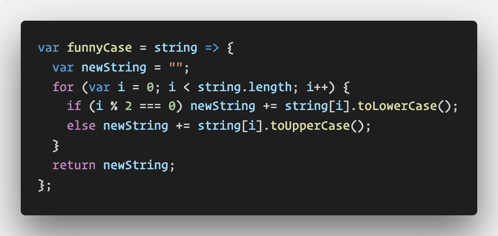
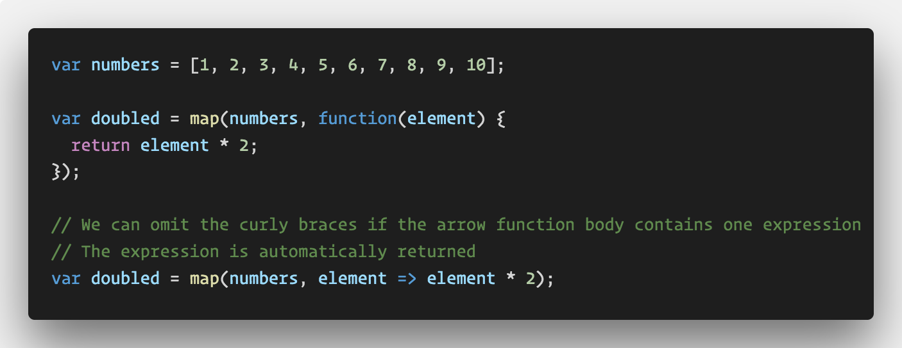
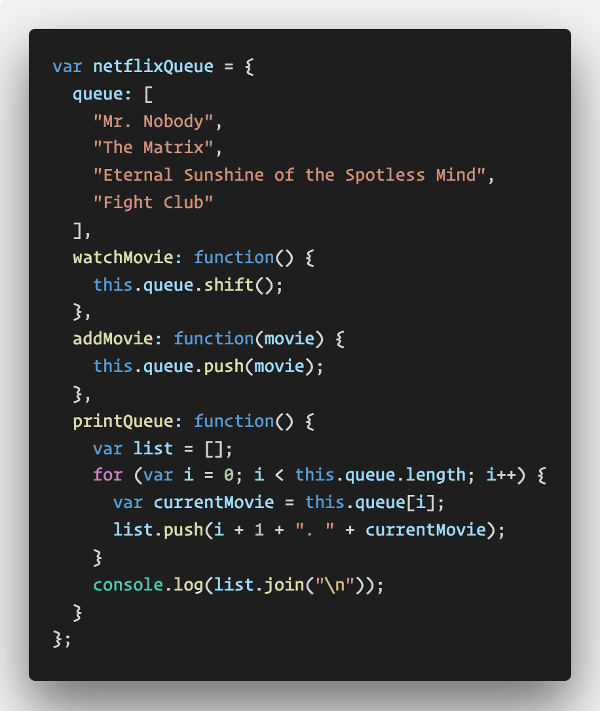

# Arrow Function Practice

In this activity students will convert a file with prewritten code over to use arrow functions where suitable.

## Instructions

* Open [Solved/index.js](Solved/index.js) in your editor and run the code. Point out that even though we've converted a few of the examples over to use arrow functions, the code works exactly the same as it did before.

  

  * Point out again how we can omit the parentheses around the arrow function parameters if there is only one. This **does not** work if the arrow function has multiple or no parameters.

  

  * Point out again how we can omit an arrow function's curly braces as well if the arrow function body only contains one expression. The single expression is automatically returned from the function when we use this shorter syntax.

  * Finally point out the `netflixQueue` object. Ask the class: Why didn't we convert the functions here to arrow functions?

  

  * Whenever we're defining an object literal, we usually don't want to write its methods as as arrow functions since `this` inside of the arrow function will refer to whatever object the once we're defining is inside of (usually the window or global object).

  * Inform the class that for now, the main thing they need to understand is that we can replace most regular functions with arrow functions. The main place students should avoid using arrow functions is when defining object methods.

* Update this example to use arrow functions **where suitable**. If successful, the code should still work the exact same way.

* Take a few moments to answer any remaining questions.
