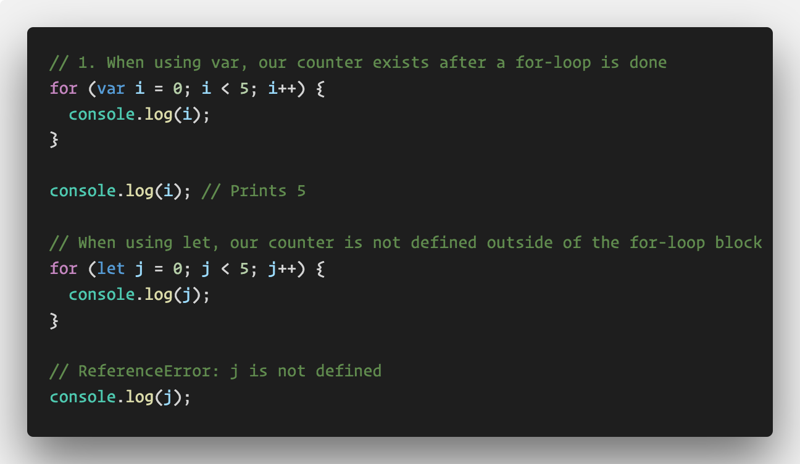
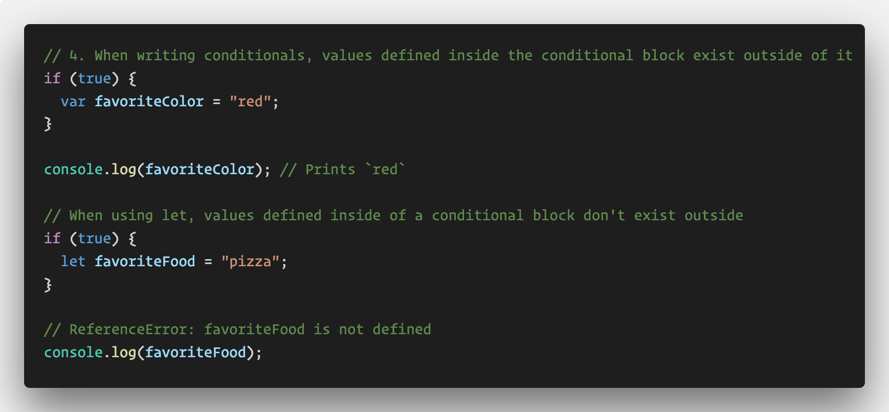
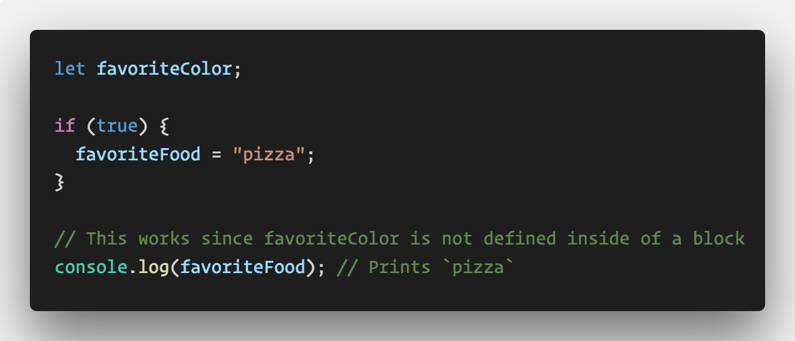

# Let and Block Scope

In this example we will demonstrate the new `let` identifier and how block scoping works.

* Explain to the class that by now they should be familiar with function scope. Have a volunteer offer up their explanation for what this means.

  * With function scope, variables defined inside of a function body are only available inside of that function.

* Explain that ES6 offers us a new way to define variables using the `let` identifier. Unlike `var`, `let` is block scoped.

* Inform the class that a "block" is created whenever we have a pair of curly braces. This includes loops and conditional statements as well as function bodies. Since `let` is block scoped, any variables we define using `let` inside of a block are only available inside of that block.

* This can help us avoid a few silly mistakes in our code. Point out the first example in [index.js](index.js).

  

  * Point out how our for-loop counter continues to exist after the for-loop has ended. This could cause issues if we wanted to refer to a different variable with the same name as the counter later.

  * Even though the `let` declaration is not technically inside of the curly braces, it's considered to be part of the block anyway in this case. 

  * Point out how the counter no longer exists after the loop is done when we use `let`.

  

  * Point out how when using `let`, any values defined inside of a conditional block no longer exist outside of the conditional. Explain that this also helps us avoid bugs in our code. For example, if we declare a variable inside of a conditional, it may not exist later if we try to refer to it. However, we can still update and use existing values inside of conditionals.

  

* Inform the class that going forward, we will no longer be using `var`. Unlike arrow functions and regular functions, we can completely replace `var` with let.

* Take a moment to answer any questions, but avoid getting too off track! We'll go over `const` next!