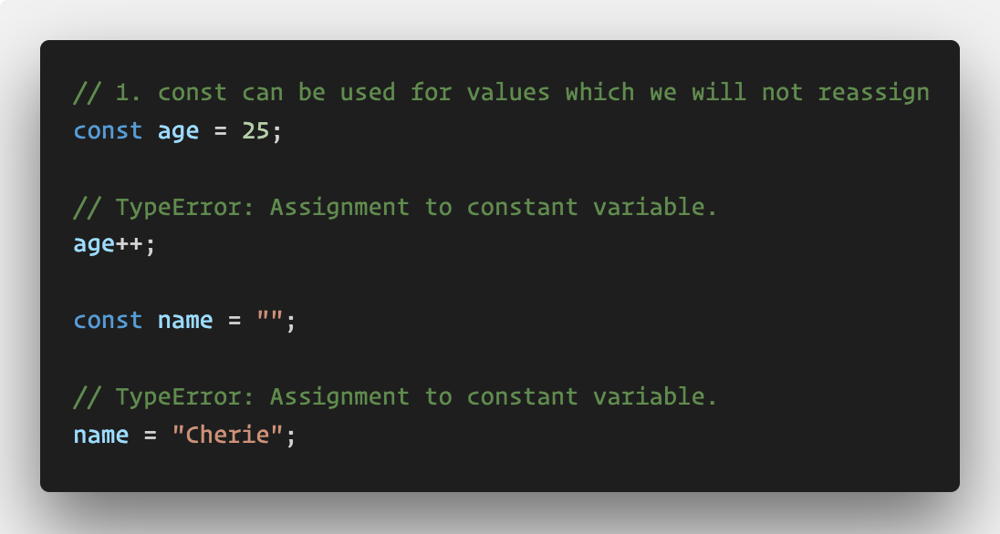
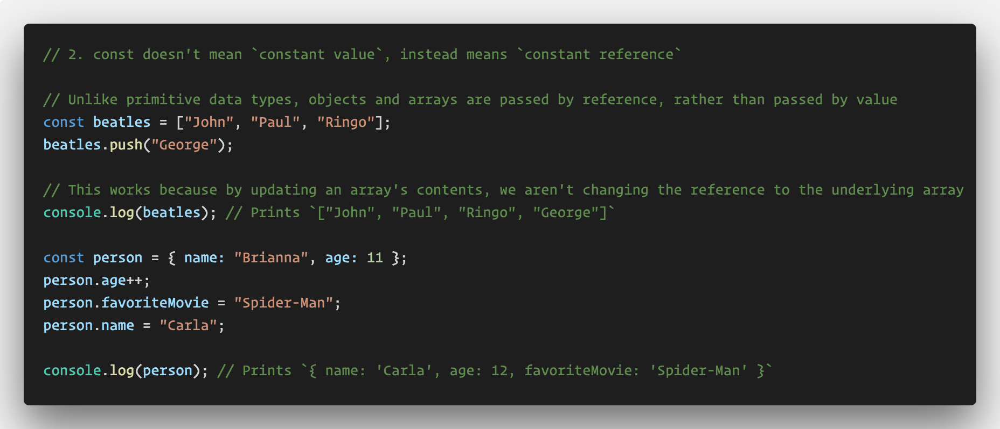
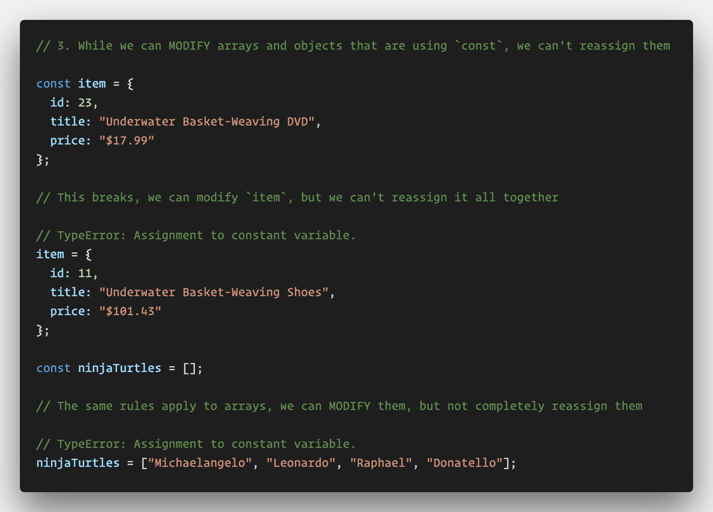

# Constant Reference

In this demonstration we will cover the new `const` identifier and when it should be used.

* Explain to the class that while we _can_ replace `var` in all of our code with `let`, we also have one more new option for declaring variables, `const`.

* Ask the class: Can anyone tell me what they think `const` is used for in JavaScript?

  * Odds are, a student will answer that `const` is like `let`, except that it's for variables which we aren't going to change. This is _mostly_ true.

* Explain that `const` has the same rules as `let` for block scoping, with one key difference: a variable declared with `const` cannot be reassigned.

* Inform the class that using `const` can help prevent us from accidentally reassigning values we don't mean to. It also can help us document important values in our code. We want to use `const` over let whenever possible.

* Open [index.js](index.js) and go through each example.

  

  * Point out that whenever we try to reassign a variable declared with `const`, we get an error in the console. Whenever we're working with primitive types such as strings or numbers, even _modifying_ the value e.g. `age++`, is considered to be reassigning it. This is because primitive types are "passed by value", i.e. a new value is created and referred to in memory anytime we modify a primitive type.

  

  * Point out how in the second example, we can update the array and object as long as we aren't reassigning them completely, i.e. using the `=` operator to assign the variables a new values.

  * Explain that `const` in JavaScript doesn't mean "constant value", but rather "constant reference". Because arrays and objects are non-primitive values, they are "passed by reference", i.e. modifying an array or object doesn't replace the underlying variable in memory. This is why we can push to the array or update the object's properties.

  

  * To check for understanding, ask the class: Why isn't this last example allowed?

    * While we can modify arrays and objects declared with `const`, we still can't reassign them completely.

* Explain that when deciding to use `const` or `let`, prefer `const`. Use `let` whenever the value will need to be completely reassigned, or when the value will need to be modified and is not an array or object.

* Take a moment to answer any remaining questions.