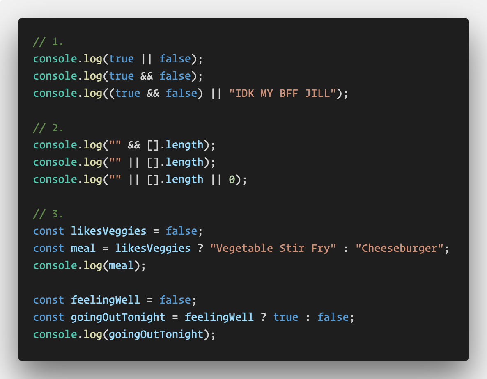

# Truthy Falsey

In this example we will briefly go over short circuit evaluation as well as ternary expressions. While not new syntax at all, these are heavily used in React and may require some explanation.

Go over the code in [index.js](index.js) and have students guess or explain what each value will log and why. 

  

Be sure to explain how some values can be cast to true or false depending on what they are, hence the terms truthy and falsey values.

Explain the flow our code takes as we use the `||` or `&&` operators.